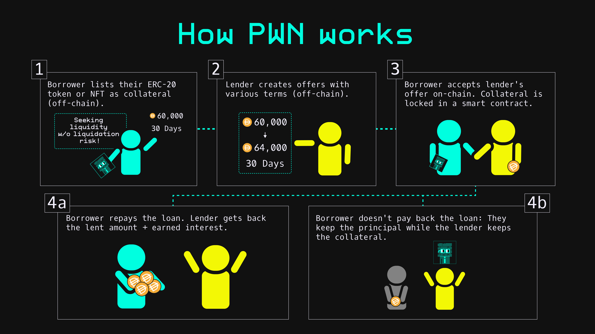

# Introduction to PWN

### What is PWN?&#x20;

PWN is a peer-to-peer lending protocol on Ethereum and Polygon that allows users to **borrow and lend digital assets backed by any other digital assets**. Borrowers can receive a loan of ERC-20 tokens backed by their own ERC-20 tokens or NFTs, and lenders can earn interest on their tokens by granting these loans. This process is managed by smart contracts that are completely **trustless, decentralized and immutable**.

<figure><figcaption></figcaption></figure>

### Why PWN?&#x20;

PWN is a marketplace in which borrowers and lenders come together to agree to loan terms for arbitrary tokens backed by arbitrary tokens or NFTs. PWN does not whitelist what is allowed on the platform. As long as digital assets conform to the ERC-20, 721, or 1155 standards, they can be used on the platform.

Additionally, since loans are not based on any price oracles, there is no risk of being liquidated before the loan duration has been completed. As long as you pay your loan back in the agreed-upon timeframe, your collateral is returned to you — guaranteed.

PWN does this with minimal on-chain transactions, allowing users to freely create as many loan requests and loan offers as they like. You pay gas costs only when a deal is finalized or when cancelling a loan offer.&#x20;

### How do I interact with PWN as a borrower?&#x20;

As a borrower on PWN, you create a "loan request" by selecting the token and amount you would like to borrow and the duration that you'd like to pay it back in. You then select the asset (ERC-20 or NFT) that you would like to use as collateral. This process creates an off-chain record that appears in our UI so lenders can make offers on it.

### How do I interact with PWN as a lender?&#x20;

As a lender, you can view the list of loan requests on each chain we support and make offers to the borrower. These offers are not required to be the exact token or amount they would like, but it may help you get accepted if it's close. Once an offer is made, the borrower then needs to accept it, which transfers the collateral into the PWN Protocol, and the loan from the lender to the borrower.

In the event of a default on a loan, the lender can then claim the collateral from the PWN Protocol, rather than the borrower.&#x20;

### Does PWN charge any fees? How much gas do I need to pay?&#x20;

PWN does not currently charge any fees, but we have plans to do so in the future. Gas is paid only when accepting an offer as a borrower, cancelling an offer as a lender, or when initially approving assets to be used.&#x20;

### Is there a PWN token?&#x20;

Currently, there's no PWN token.
